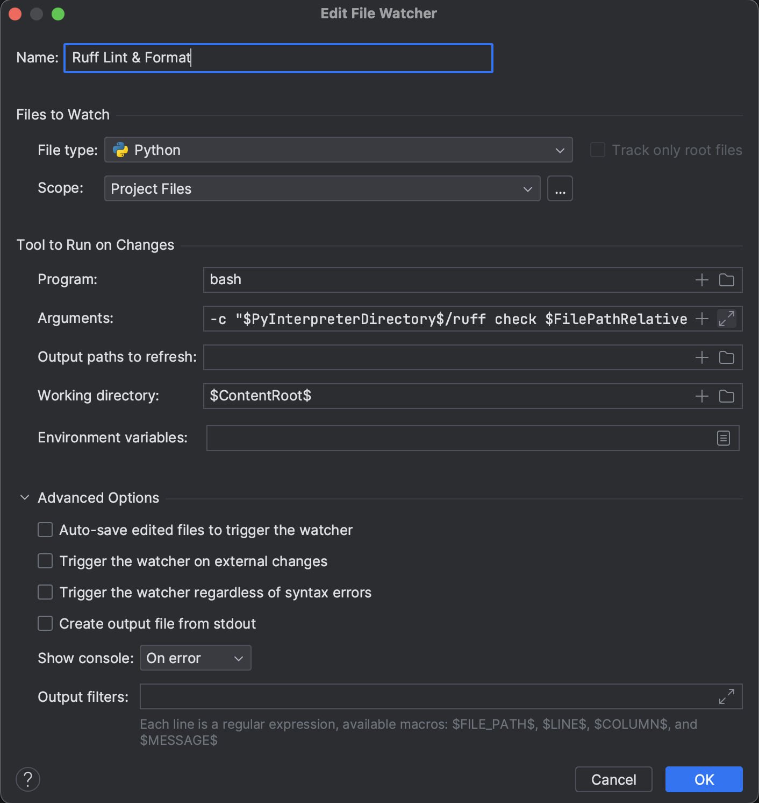

# Configure Ruff's Linter and Formatter

This documents ensures Ruff to lint and format the file on each save action.

## Configure In PyCharm

1. Import this project into PyCharm; please ensure a virtual environment has been created
2. Ensure all dependencies for code development are installed follow [README.md](../README.md)
3. Open Settings -> Tools -> File Watchers, and add a new file watcher named with the following configurations with the Arguments filled with

```shell
-c "$PyInterpreterDirectory$/ruff check $FilePathRelativeToProjectRoot$ && $PyInterpreterDirectory$/ruff format $FilePathRelativeToProjectRoot$"
```



4. Open Settings -> Tools -> Actions On Save to ensure "File Watcher: Ruff Lint & Format" is toggled.
5. Save to apply all the above settings.

## Configure in VSCode

1. Import this project into VS Code; please ensure a virtual environment has been created
2. Ensure all dependencies for code development are installed follow [README.md](../README.md)
3. Install and enable the [Ruff](https://marketplace.visualstudio.com/items?itemName=charliermarsh.ruff) plugin.
4. Paste the following settings into your `.vscode/settings.json` but ensure all fields marked with `ATTENTION`

```json
{
  "editor.formatOnSave": true,
  "editor.formatOnPaste": false,
  "[python]": {
    "editor.defaultFormatter": "charliermarsh.ruff",
    "editor.codeActionsOnSave": {
      "source.fixAll": "never",
      "source.organizeImports": "always",
      "source.unusedImports": "always"
    }
  },
  "ruff.enable": true,
  "ruff.path": [
    "venv/bin/ruff",  // ATTENTION: Change it to the ruff in your virtual environment
  ],
  "ruff.configuration": ".ruff.toml",
  "ruff.configurationPreference": "filesystemFirst"
}
```

5. Type `Ctrl+Shift+P` to call up the command palette and type and click `Ruff: Restart Server` to reload the settings.
